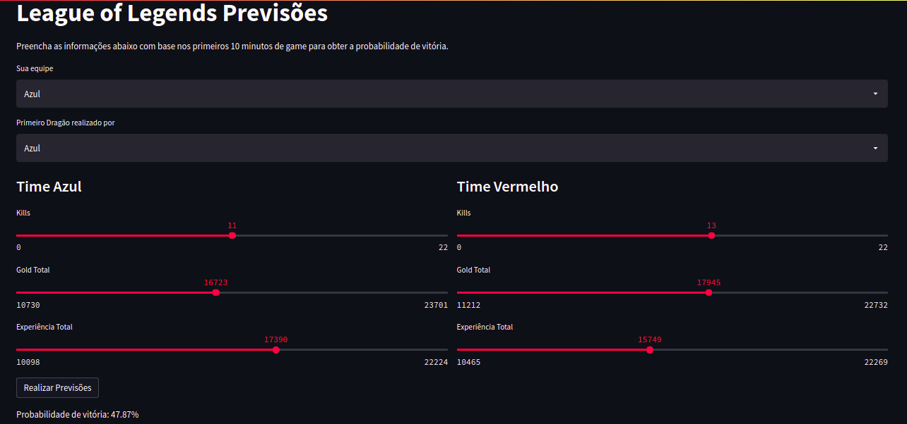

# Prevendo resultados de partidas de League of Legends.

# Sobre o Projeto

O objetivo desse projeto foi avaliar o impacto do early game no resultado final de partidas de [League of Legends](https://www.youtube.com/watch?v=mwERJ6qJPuc), treinar um modelo de machine learning para prever a probabilidade de uma equipe ser vencedora e realizar o deploy na forma de uma aplicação online. Os dados utilizados contém informações referentes aos 10 primeiros minutos de aproximadamente 10.000 partidas rankeadas (do diamante até o mestre) coletadas diretamente da API da Riot Games e disponíveis publicamente no [Kaggle](https://www.kaggle.com/bobbyscience/league-of-legends-diamond-ranked-games-10-min).

Link da aplicação: https://share.streamlit.io/vinitg96/app_previsoes_league_of_legends/main/app.py

Código fonte da aplicação: https://github.com/vinitg96/App_Previsoes_League_of_Legends

Publicação no Medium: https://medium.com/@vini.guerra87/prevendo-o-resultado-de-partidas-de-league-of-legends-com-python-3c15c10a8784
# Layout

# Tecnologias utilizadas:
- Python
- Pandas e Numpy (Manipulação dos dados)
- Matplotlib e Seaborn (Visualização)
- Scikit-Learn e Scikit-Optimize (Machine Learning)
- Streamlit (Deploy)

# Autor

Vinicius Torres Guerra

Linkedin: https://www.linkedin.com/in/vinicius-torres-05a35695/

E-mail: vini.guerra2@hotmail.com

